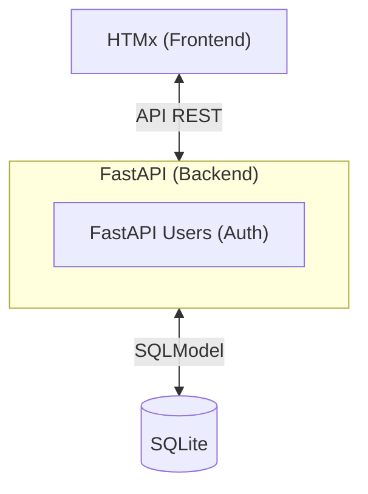

# Leafy ILS



## Requirements

Note: use a venv for python installation
    python3 -m venv venv
    source venv/bin/activate
    deactivate

- global:
    - python
    - pip
- FastAPI:
    - pip install starlette
    - pip install pydantic
    - pip install "fastapi[standard]"
- SQLModel:
    - pip install sqlmodel
- static analysis
    - pip install ruff
- unit tests
    - pip install -U pytest
    - pip install pytest-cov
    - to launch tests: in poc/sqlmodel `pytest --cov=src --cov-report term-missing --cov-branch`

## Launcher

- FastAPI: `fastapi dev main.py`

## Tailwind

```npx tailwindcss -i templates/main.css -o static/css/main.css --watch```

## Sources

https://github.com/jowilf/starlette-admin-demo/tree/main

## Inspirations

https://github.com/timmashkov/fastapi_shop
https://github.com/mjhea0/awesome-fastapi
https://components.willpinha.link/
https://pagedone.io/blocks#product-Marketing
https://github.com/nyash04/daisyui-landing-page
https://tailwindui.com/components/marketing/sections/blog-sections

## daisyui theme
https://github.com/Serendipity-Theme/daisy-ui
https://github.com/HikaruEgashira/daisy-theme-nord/tree/main
https://github.com/rose-pine/daisyui
# TODO

https://jowilf.github.io/starlette-admin/user-guide/authentication/
https://github.com/volfpeter/fasthx
https://whoosh.readthedocs.io/en/latest/intro.html
https://www.chromium.org/developers/design-documents/create-amazing-password-forms/

# Other ILS

https://www.sigb.net/
https://waterbear.info/
https://github.com/rero/rero-ils

# Sources livre

https://api.gouv.fr/les-api/api-sudoc
https://api.gouv.fr/documentation/api-sudoc
https://pymarc.readthedocs.io/en/latest/index.html#pymarc.marcxml.parse_xml_to_array
https://github.com/NatLibFi/marc-record-js?tab=readme-ov-file

https://www.leslibraires.fr/livre/23683049-jacaranda-gael-faye-grasset
https://www.leslibraires.fr/recherche/?q=9782246831457
https://www.googleapis.com/books/v1/volumes?q=isbn:9782246831457
https://developers.google.com/books/docs/viewer/developers_guide?hl=fr

## Art

https://unsplash.com/fr/photos/art-abstrait-rose-et-vert-ruJm3dBXCqw

## Parsing
https://github.com/gwu-libraries/launchpad/blob/8901f91e3dc458baf97a09f0da8dc51218387c8e/lp/ui/apis.py#L57
https://github.com/safwansamsudeen/infilib/blob/main/src/lib/helpers.js#L270

## Scearch engine 

https://lab.abilian.com/Tech/Search/Comparison%20of%20open%20source%20search%20engines/
https://supabase.com/blog/postgres-full-text-search-vs-the-rest
https://github.com/quickwit-oss/tantivy as a library !
https://github.com/typesense/typesense
https://github.com/valeriansaliou/sonic
https://github.com/sqlalchemy/sqlalchemy/discussions/9466
https://stackoverflow.com/questions/68676884/sqlite-using-fts5-table-to-perform-all-queries-instead-of-main-table
https://news.ycombinator.com/item?id=41198422
https://github.com/abiliojr/fts5-snowball
https://stackoverflow.com/questions/71830772/how-can-i-allow-loading-sqlite-extensions-with-a-sqlalchemy-engine