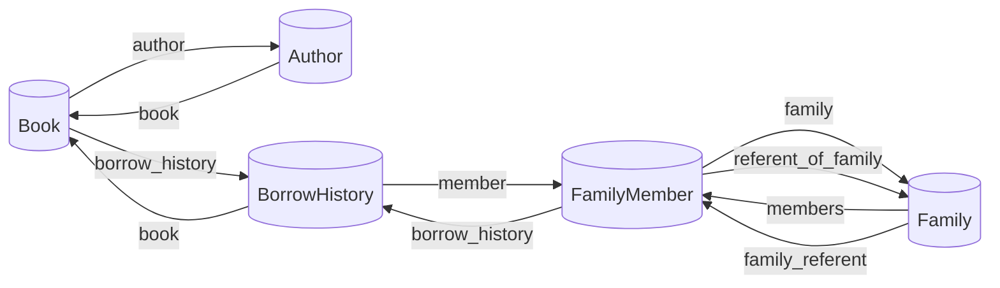
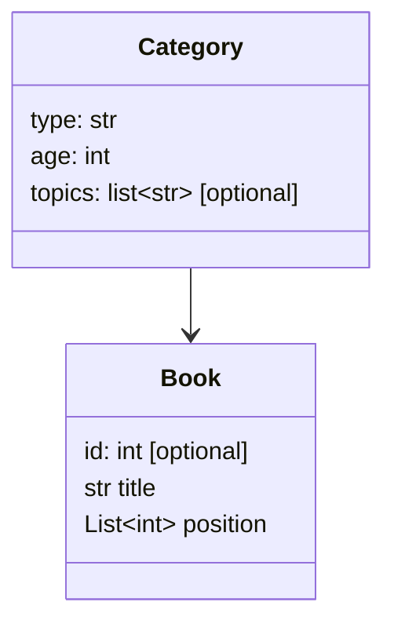

# Database details

## Overview

From database we will need to save information about:

- books
    - and why not their author
- members
    - and their family
- borrowing information between books and members with history

### Books catalog details

For books catalog we need:

- title
- author
    - name
    - biography (optional)
- synopsis
- edition
- part of a series (optional)
    - number
    - total of tomes (optional)
- category
    - type: roman, bd, documentaire, album, cartonné (default: age 0)
    - age: adulte, ado, enfant
    - subjects / topics (optional)
- catalog: pierre_vives, arbousiers
- langage (default: french)
- cover (picture) (optional)
- date of registration
- borrow_information
    - available
    - which member
    - history of borrowing
- possibility of reservation
- only for admin
    - reserved
    - member who has currently borrowed the book
    - last date of borrow

### Members details

For members we need:

- referent name
- contact (mandatory, at least one)
    - phone number (optional)
    - email (optional)
- last adhesion date (mandatory)
- family (optional)
    - names
    - ages

### Link between members and books

- list of books related to a user
    - book status: borrowed, borrowing, reserved
    - date of borrowing
    - date of return
    - date of reservation

## Tools design

For database manipulation we select SQLModel which is based on the use of SQLAlchemist and SQLite.

SQLModel allows us to access database through Python classes based on Pydantic format.

### Database's tables relationship

- Book and Author will be used to make the catalog
- each adhesion is made by Family
- each Family is composed of at least one FamilyMember as referent
- Book and Family need to shared a BorrowHistory

### Python classes

#### Book

### Borrowing database link

Book --> family name --> member

ex:
- member: "Smith"
    - family name:
        - "John Smith"
        - "Junior Smith"
        - "Zelda Williams"
- book: "Once Upon A Time"
    - currently borrowed by:
        - family name:
            - "Zelda Williams"
        - borrowing date
        - no returning date
    - borrowed people
        - list of:
            - family name
            - borrowing date
            - returning date

### Author database link

Book --> author

with author:

- name
- bibliography
