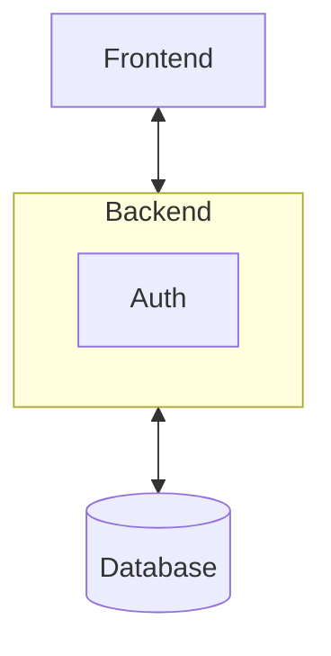
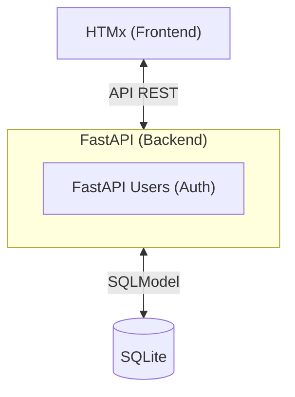

# Technical idea

Following our constraints, we will look in priority for opensource tools.

TODO: add more information here

TODO: add more information here

## Other Ideas

Django
ReactJS
SvelteKit

## Solution

- Frontend
    - [HTMx](https://htmx.org/)
    - [daisyui](https://htmx.org/)
- Backend
    - [FastAPI](https://fastapi.tiangolo.com/)
    - Auth
        - [FastAPI Users](https://fastapi-users.github.io/fastapi-users/10.1/)
- ORM
    - [SQLModel](https://sqlmodel.tiangolo.com/)
- DataBase
    - [SQLite](https://www.sqlite.org/)

